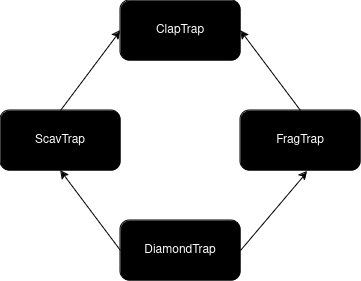

# ClapTraps
In this module, a base class **ClapTrap** is created, with its own attributes and member functions. 
Then derived classed **ScavTrap** and **FragTrap** are created, with their own speficic new member functions, besides the ones derived from **ClapTrap**.
Finally the **DiamondTrap** class is created, which is derived from both the **ScavTrap** and **FragTrap**. 
This illustrates the **diamond problem**, which occurs when two superclasses of a class have a common base class, which can cause ambiguities.
To bypass this problem, one has to use the 'virtual’ keyword when making the classes **ScavTrap** and **FragTrap**, to avoid two copies of the base class **ClapTrap**. 
